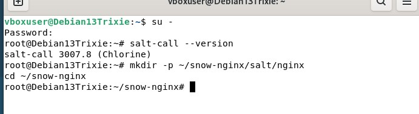
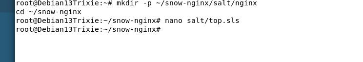
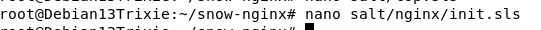
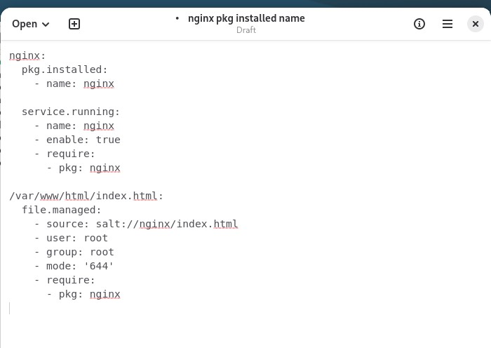
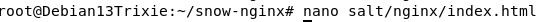
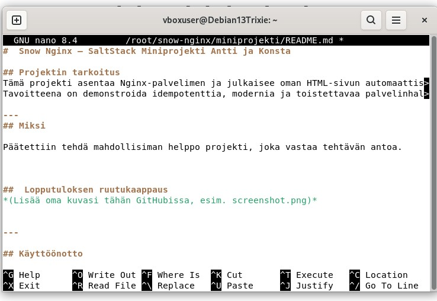

#  Snow Nginx — SaltStack Miniprojekti Antti ja Konsta

## Projektin tarkoitus  
Tämä projekti asentaa Nginx-palvelimen ja julkaisee oman HTML-sivun automaattisesti SaltStackin avulla tyhjään Debian 13 -virtuaalikoneeseen. 

- Nginxin asennuksen automatisointi
- Oma HTML sivu
  


---
## Miksi

Päätettiin tehdä mahdollisiman helppo projekti, joka vastaa tehtävän antoa.

Lisäämäni personoidut elementit:
- oma HTML-sivu, jossa näkyvät tekijät ja kurssi
- siistitty HTML-rakenne ja kevyt ulkoasu
- parannettu README-ohjeistus ja visualisointi
- selkeä kuvaus idempotenssista ja projektin arkkitehtuurista

  ## Käyttöönotto

# 1. Lataa projekti
git clone https://github.com/Vauzao/miniprojekti.git
cd miniprojekti

# 2. Aja Salt-tilat (asentaa Nginxin + kopioi HTML-sivun)
sudo salt-call --local --file-root salt/ state.apply

# 3. Avaa sivu selaimessa
# (Debianin selaimeen: http://localhost)

# 4. Projektin tiedostorakenne:
# miniprojekti/
# ├── README.md
# ├── salt/
# │   └── nginx/
# │       ├── init.sls        # Nginx + HTML deploy
# │       └── index.html      # Sivusi, jonka Salt kopioi /var/www/html/index.html
# └── ...

# 5. Muokkaa HTML-sivua
nano salt/nginx/index.html

# 6. Päivitä sivu ajamalla Salt uudelleen
sudo salt-call --local --file-root salt/ state.apply

# 7. Idempotenssin testaus:
#   - Aja Salt kerran:   changed > 0
#   - Aja Salt uudelleen: changed = 0


###  Lataus, jos haluat kokeilla itse
```bash
git clone https://github.com/Vauzao/miniprojekti.git
cd miniprojekti


##  Projektin vaiheiden kuvankaappaukset
- Tein projektille kansion
- . 
- Tein salitlle top kansion, jotta salt tietää mitä ajaa
- .
- Top tiedosto
- 
- Tiedosto joko saltin kuuluu ajaa eli nginx, joka asentaa nginx palvelimen, käynnistää sen ja kopio HTML sivun
- 
- 
- Tässä näkyy idempotentti
- 
- 
- 
- Tässä html sivun nanotiedosto
- 
- ja tässä html sivu selaimessa
- 
- tässä readme
- .
Lopuksi vielä git add, commit ja push 


---

## Käyttöönotto

käytä komentoa: sudo salt-call --local --file-root salt/ state.apply

koodin rakenne: ls /root/snow-nginx/miniprojekti

http://localhost


###  Lataus, jos haluat kokeilla itse
```bash
git clone https://github.com/Vauzao/miniprojekti.git
cd miniprojekti

